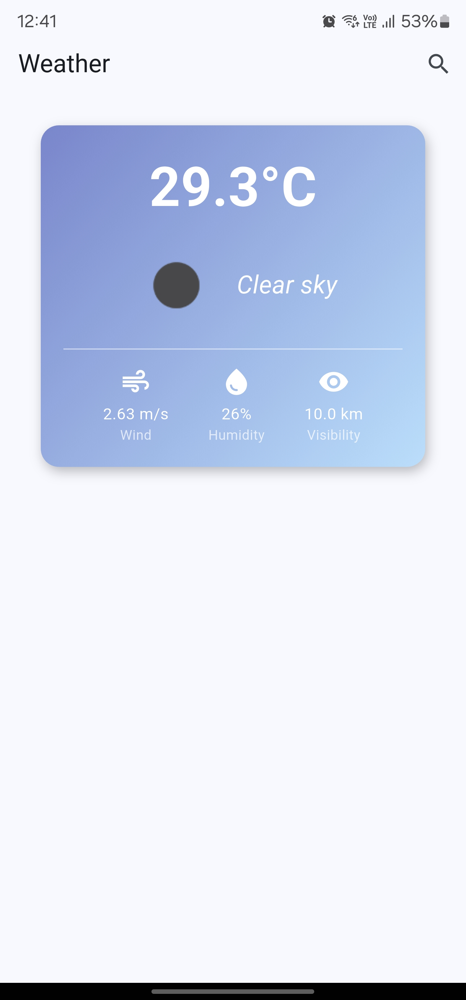
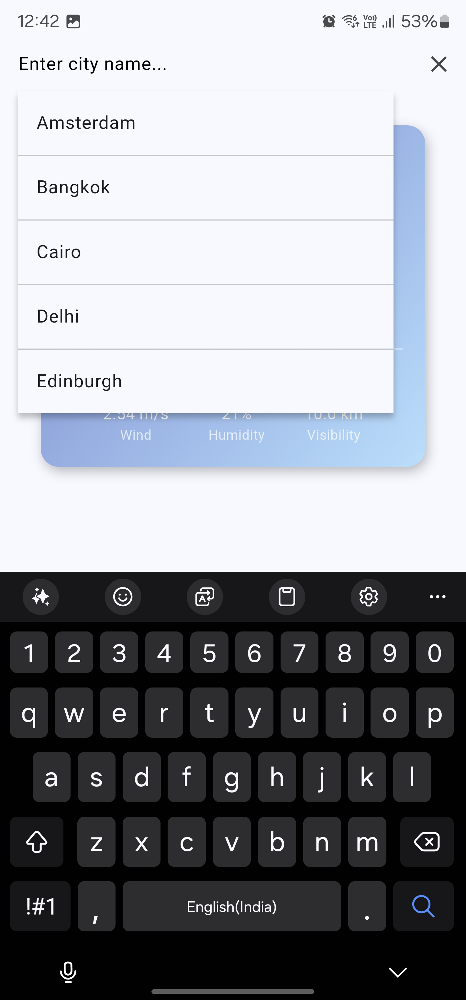

# Weather App

This is a Flutter-based Weather App that provides weather updates and forecasts. The app is designed to be cross-platform and works on Android,iOS.

## Features
- Real-time weather updates
- User-friendly interface
- Cross-platform support

## Installation

### Prerequisites
- Flutter SDK installed on your system. You can download it from [Flutter's official website](https://flutter.dev/docs/get-started/install).
- Ensure that you have set up your development environment for your target platform (Android, iOS, web, or desktop).

### Steps
1. Clone the repository:
   ```bash
   git clone <repository-url>
   cd weather_app
   ```

2. Install dependencies:
   ```bash
   flutter pub get
   ```

3. Run the app:
   - For Android/iOS:
     ```bash
     flutter run
     ```

## Screenshots
Add screenshots of the app in the `assets/` folder and reference them here. For example:

### ✅ Home Screen


### ✅ Search Bar


